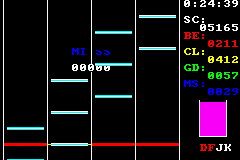

# GBA（ゲームボーイアドバンス）のエミュレータ上で動くリズムゲームシミュレータの作成
大学の講義にて，GBAエミュレータを用いた組込みプログラミングの学習を行った．  
グループで一つのゲームを作成するという課題であったが，リズムゲームを作ろうという私の案が却下されたためここに実装した．  
音声なし．音声の実装は次の機会に行う．   

## 動作環境
windows10以上

## 遊び方
1. binフォルダのvbawin.exeを起動．（GBAエミュレータ本体）
2. エミュレータでrhythm_game_simulator.mbを読み込む

## コンパイルについて（Makefile）
Cファイル変更後，
```
make NAME=rhythm_game_simulator
```
コマンドを実行．mbファイルができればコンパイル成功

## ゲームについて
### タイトル画面

- C言語風にタイトル画面を書いたら面白いと思っただけ．
- キーコンフィグを変える必要あり．
- GBAのボタンABLRをそれぞれキーボードのFJDKに.

<br></br>
### チュートリアルを行うかどうか

- ちなみにチュートリアルは用意してないためYESを選んでもNOを選んでも同じ．

<br></br>
### オプション

- PATTERN
  - STAIRS -> リズムが一定の階段型
  - JACK   -> リズムが一定の縦連
  - STREAM -> リズムが一定の乱打
  - 未実装のモード有り

- SPEED
  - ノーツが流れる速さ．数字が大きいほど速い．
  - おすすめは6．玄人なら8．
 
- INTERVAL
  - 1小節を何分割にするか．
  - おすすめは16分割．玄人なら32分割．
 
- TIME
  - この時間耐えきるとクリアになる．
  - ENDLESSモード有り

<br></br>
### ゲーム画面


- 判定幅
  - BESTは±0フレーム
  - COOLは±1フレーム
  - GOODは±2フレーム
  - MISSはそれ以外
  - フレームレートは不明．デバイスの性能による可能性がある点に注意．
 
<br></br>
### リザルト画面

- カラフル

### rhythm_game_simulator
Created a simple game on a GBA (GameBoy Advance) emulator.
